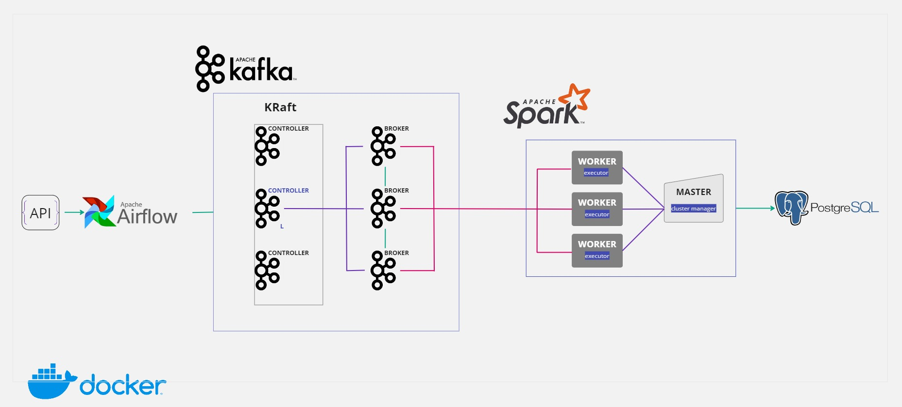

# ⚙️ Pipeline de Procesamiento de Datos en Tiempo Real

Este proyecto consiste en un pipeline de procesamiento de datos en tiempo real, que integra varias tecnologías para la recolección, procesamiento y almacenamiento eficiente de datos. La arquitectura está implementada utilizando contenedores Docker para facilitar el despliegue y la gestión.

---
---

## 📑 Índice

0. [Tecnologías](#-tecnologías)
1. [Arquitectura](#️-arquitectura)
   * [Descripción del Flujo de Trabajo](#descripción-del-flujo-de-trabajo)
2. [Ejecución](#ejecución)
   * [Desplegar Contenedores](#0--desplegar-contenedores)
   * [Crear Topic](#1--crear-topic)
   * [Configuración del Productor](#2--configuraración-del-productor)
   * [Configuración del Consumidor](#3--configuraración-del-consumidor)
   * [Crear DB destino](#4--crear-db-destino)
   * [Iniciar el Productor](#5--iniciar-el-productor)
   * [Iniciar los Consumidores](#6--iniciar-los-consumidores)

---
---

## </> Tecnologías


---
---

## ⛩️ Arquitectura



---

### Descripción Flujo de Trabajo

1. **Recolección de Datos desde una API (Airflow):**
   - El pipeline comienza con **Apache Airflow**, que se encarga de orquestar una tarea que consulta periódicamente una **API** para recolectar datos en bruto.

2. **Transmisión de Datos en Tiempo Real (Kafka en Modo KRaft):**
   - Los datos recolectados por Airflow se publican en un topic de un clúster de **Apache Kafka** configurado en **modo KRaft** (Kafka Raft), eliminando la necesidad de Zookeeper.
   - El clúster de Kafka está dividido en dos componentes principales:
     - **Controladores:** Gestionan la metadata y las operaciones del clúster.
     - **Brokers:** Manejan la transmisión, almacenamiento y recuperación de mensajes.

3. **Procesamiento de Datos (Apache Spark):**
   - **Apache Spark** consume los mensajes desde los brokers de Kafka. El clúster de Spark procesa los datos entrantes en tiempo real. La arquitectura de Spark se compone de:
     - **Master:** Actúa como el gestor del clúster.
     - **Workers:** Ejecutan las tareas de procesamiento de datos.

4. **Almacenamiento de Datos (PostgreSQL):**
   - Una vez procesados, los datos se almacenan en una base de datos **PostgreSQL** para su posterior análisis y consulta.

5. **Despliegue con Contenedores (Docker):**
   - Toda la arquitectura, que incluye Airflow, Kafka, Spark y PostgreSQL, se despliega y gestiona utilizando contenedores de **Docker**. Esto asegura la consistencia de los entornos y simplifica el proceso de despliegue.

---
---

## 💻 Ejecución

- Iniciar contenedores por medio del uso del script: *start.sh*
- Crear el topic en kafka
- Configurar variables en Airflow referentes a la configuración del productor y del topic
- Crear la DB de destino en PostgreSQL
- Iniciar el *Productor*: Ejecutar el dag
- Iniciar los *Consumidores*: Ejecutar el script .py de spark: streming-procces.py

Esos son los pasos fundamentales para el uso del proyecto. 

---

   ### 0- Desplegar contenedores

Desde la terminal ingresar en la carpeta del proyecto, ubicarse en la ruta /docker/docker-compose y ejecutar el archivo:

```bash
./start.sh
```

El script start.sh se encarga de generar las imágenes personalizadas según lo definido en los archivos .Dockerfile y de iniciar los contenedores.


*Nota*: para eliminar todos los contenedores del proyecto ejecutar el archivo:

```bash
./down.sh
```

---

   ### 1- Crear topic

#### Comandos a ejecutar

 - **Localizar el script kafka-topics.sh**:

```bash
docker exec -it kafka-broker-1 find / -name kafka-topics.sh
```

 - **Configurar y crear el topic**:

```bash
docker exec -it kafka-broker-1 /opt/kafka/bin/kafka-topics.sh --create --topic random-user --bootstrap-server kafka-broker-1:9095 --partitions 3 --replication-factor 3
```

 - **Verificar topic**:

```bash
docker exec -it kafka-broker-1 /opt/kafka/bin/kafka-topics.sh --list --bootstrap-server kafka-broker-1:9095
```

#### 📙 Notas

 - **--topic random-user**: Define el nombre del topic a crear, en este caso *random-user*. (Un topic en Kafka es un canal o categoría donde los mensajes son publicados por productores y consumidos por consumidores.)
 - **--bootstrap-server kafka-broker-1:9095**: Especifica la dirección de un broker de Kafka al cual el comando se conectará para crear el topic. (Un broker es un servidor dentro del clúster de Kafka que maneja el almacenamiento y la transmisión de mensajes para los topics.)
 - **--partitions 3**: Indica que el topic *random-user* se dividirá en 3 partes separadas. Cada partición puede almacenar una porción de los mensajes, lo que permite una mayor escalabilidad y paralelismo. Esto permite que diferentes consumidores puedan leer de diferentes particiones simultáneamente, mejorando la eficiencia y velocidad de procesamiento.
 - **--replication-factor 3**: El factor de replicación determina cuántas copias de los datos de cada partición se mantendrán en diferentes brokers para asegurar la redundancia y la tolerancia a fallos. En este caso, 1 copia primaria y 2 copias secundarias.


 - **Eliminar topic**:

```bash
/opt/kafka/bin/kafka-topics.sh --bootstrap-server kafka-broker-1:9095 --delete --topic random-user
```

---

   ### 2- Configuraración del productor

#### Crear las siguientes variables en Airflow:

- **Variable 1: Configuración del Productor**
   
   - **Key**: `kafka_producer_config`
   - **Value**:

   ```json
   {
     "client_id": "airflow_producer",
     "bootstrap_servers": "kafka-broker-1:9095,kafka-broker-2:9096,kafka-broker-3:9097",
     "key_serializer": "org.apache.kafka.common.serialization.StringSerializer",
     "value_serializer": "org.apache.kafka.common.serialization.StringSerializer",
     "acks": "all",
     "retries": 3,
     "linger_ms": 5,
     "batch_size": 16384,
     "compression_type": "gzip",
     "max_in_flight_requests_per_connection": 1,
     "request_timeout_ms": 20000,
     "buffer_memory": 5242880,
     "max_block_ms": 5000
   }

- **Variable 2: Configuración del Productor**

   - **key**: `kafka_topic`
   - **value**: `random-user`

#### 📙 Detalles sobre los parámetros de configuración, consultar: [notas](./airflow/config/README.md)

---

   ### 3- Configuraración del consumidor

La siguiente configuración la utilizan los workers de Spark para consumir los datos del topic de Kafka.
La misma está almacenada en formato json en un volumen de Spark y es recperada mediante una función al ejecutarse el script .py del consumidor.

```json
{
    "kafka.bootstrap.servers": "kafka-broker-1:9095,kafka-broker-2:9096,kafka-broker-3:9097",
    "subscribe": "random-user",
    "startingOffsets": "latest",
    "maxOffsetsPerTrigger": 5000,
    "fetch.max.bytes": 104857600,
    "fetch.min.bytes": 1048576,
    "session.timeout.ms": 30000,
    "heartbeat.interval.ms": 10000
  }
```

#### 📙 Detalles sobre los parámetros de configuración, consultar: [notas](./spark/config/README.md)

---

   ### 4- Crear DB destino

   - **Acceder al contenedor de PostgreSQL**
```bash
docker exec -it postgres psql -U airflow
```

   - **Crear la base de datos**
```bash
CREATE DATABASE project_streaming;
```

   - **Conectarse a la base de datos**
```bash
\c project_streaming
```

   - **Crear la tabla**
```bash
CREATE TABLE IF NOT EXISTS users (
   id SERIAL PRIMARY KEY,
   gender VARCHAR(10),
   name_title VARCHAR(20),
   name_first VARCHAR(50),
   name_last VARCHAR(50),
   street_number INT,
   street_name VARCHAR(100),
   city VARCHAR(50),
   state VARCHAR(50),
   country VARCHAR(50),
   postcode VARCHAR(20),
   email VARCHAR(100),
   uuid UUID,
   dob_date TIMESTAMP,
   age INT,
   phone VARCHAR(20),
   cell VARCHAR(20),
   picture_large TEXT,
   email_domain VARCHAR(50)
);
```

   - **Salir de psql**
```bash
\q
```

---

   ### 5- Iniciar el *Productor*:

El dag está programado para ejecutar una tarea cada 25 segundos la cual realiza 10 consultas a la API de Random User Generator

Ingresar a la interfáz web de airflow y activar el DAG, ya que el mismo está pausado por defecto: 

   - http://localhost:8080

---

   ### 6- Iniciar los *Consumidores*:

 **Localizar el script spark-submit**:

```bash
docker exec -it spark-worker-1 find / -name spark-submit.sh
```

 **Ejecutar**:

```bash
PYTHONPATH=/opt/spark/lib /opt/spark/bin/spark-submit --packages org.apache.spark:spark-sql-kafka-0-10_2.12:3.4.0 /opt/spark/scripts/streaming-process.py
```

---